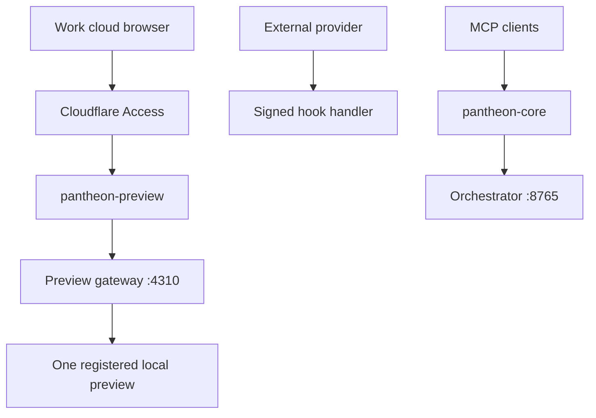

# Pantheon Preview and Infrastructure Route Taxonomy

Status: planning only. This document authorizes no Cloudflare Tunnel, DNS, Access, connector, route, or MCP change.
Domain notation: `<domain>` is a placeholder until Kryssie confirms the controlled Cloudflare zone.

## Boundary and purpose

A tunnel is appropriate here only when an intentionally launched local service needs remote inspection or an external callback. It is not deployment, a generic localhost proxy, or permission to expose the workstation.

## Route catalog

| Route | Why tunnel / intended users | Auth and allowlisted origin | Lifecycle / inactive behavior | Audit boundary | Prohibited capabilities |
|---|---|---|---|---|---|
| `mcp.<domain>` | Existing remote Orchestrator; approved agents/users | Existing identity policy; fixed MCP facade origin | Always-on core; fail closed | MCP request and elevated-tool audit | No previews, games, arbitrary routes, or weakened auth |
| `demo.<domain>` | Remote inspection of one local preview; Kryssie + Work sessions | Cloudflare Access; fixed gateway origin `4310` | Explicit start/status/stop; short expiry; 404 or “No preview active” | Preview ID, project, operator, origin, timestamps | No `?port=`, directory browsing, mutation, or filesystem roots |
| `review.<domain>` | Read-only evidence review; Kryssie/reviewers | Access; one explicitly selected evidence root | On-demand and expiring; 404 inactive | Files served, bytes, review session | No drive/repo root, upload, delete, or mutation |
| `docs-preview.<domain>` | Rendered local documentation; Kryssie/reviewers | Access; allowlisted docs renderer | On-demand and expiring; 404 inactive | Preview identity and requests | No arbitrary filesystem or command execution |
| `api-preview.<domain>` | Inspect a named local API or callback contract; developers/agents | Access or service token; fixed named API origins | On-demand, bounded expiry; 503/404 inactive | Method/path/status, redacted payload metadata | No generic API proxy or secret-bearing logs |
| `builds-preview.<domain>` | Temporary read-only build download; approved testers | Access; one selected build root | On-demand, expiry and size limits; 404 inactive | Artifact hash, bytes, requester | No parent traversal, source tree, upload, execution |
| `hooks.<domain>` | External services must reach a callback; named providers | Per-route signatures/service tokens; fixed handlers | Only with real consumer; 404 unknown path | Signature result, delivery ID, replay status | No catch-all handler or interactive Access dependency |
| `control.<domain>` | Future Command Center; Kryssie/explicit operators | Strong Access, named identities, short sessions, preferably device posture | Explicitly enabled; fail closed | Every privileged action and actor | No raw Desktop Commander, shell, secret store, DB console |
| `status-internal.<domain>` | Private consolidated health; Kryssie/operators | Access; sanitized adapters only | Persistent or on-demand; safe unavailable state | Health checks without secrets | No PIDs, tokens, stack traces, raw configs, host paths |

## Pantheon Preview Gateway v0.1

`demo.<domain>/<project>/<preview-id>` maps through one fixed gateway port to one registered preview at a time.

Required control contract:

- `start`: validate project, local origin against an allowlist, operator, expiry, and health before publishing.
- `status`: report active preview ID, safe project label, origin class, start time, expiry, and health.
- `stop`: remove routing first, then stop only the registered preview process tree.
- Automatic expiry closes stale routes.
- The inactive response is 404 or a static “No preview active” page.
- No request parameter may choose a port, hostname, filesystem path, or command.

## Origin classes and local ports

| Port/range | Origin class | Exposure rule |
|---:|---|---|
| `4173-4199` | Static/Vite previews | Local-only; gateway selects a registered healthy preview |
| `4310` | Preview gateway | The only origin published as `demo`; never arbitrary forwarding |
| `4320` | Local game client | Published only through approved game route |
| `4330` | Game HTTPS/WSS authority | Published only through `tga-games` |
| `4340` | Game admin/status adapter | Private Access only |
| `8765` | MCP Orchestrator facade | Reserved for `pantheon-core`; never preview/game traffic |

The live port registry must record command, wrapper PID, listener PID, document root/origin, operator, start time, expiry, and owning route. A port number alone never grants tunnel eligibility.

## Tunnel-object topology

| Tunnel | Lifecycle | Trust zone | Allowed hostnames |
|---|---|---|---|
| `pantheon-core` | Always on | Critical infrastructure | Existing `mcp` only; future core additions require separate approval |
| `pantheon-preview` | Explicit/on-demand | Private workshop | `demo`, `review`, `docs-preview`, `api-preview`, `builds-preview` |
| `tga-games` | On-demand first, persistent later | Player-facing product | `games`, `arena`, private `game-admin`, optional safe status |

Multiple hostnames may share a tunnel only when lifecycle and trust boundary match. MCP, previews, and player traffic stay separated. On Windows, only one connector should be installed as the service; additional on-demand connectors must be explicitly supervised or moved to another host later.

## Trust-boundary diagram

`hooks` is isolated logically because external services cannot complete interactive Access. Each hook requires a dedicated route, signature verification, replay protection, method/content-type and body-size limits.

## Naming and sessions

Prefer flat environment hostnames such as `demo-dev.<domain>` if environments ever split. Prefer paths for individual sessions: `demo.<domain>/<project>/<preview-id>` and `review.<domain>/<project>/<lane>`. Do not assume wildcard coverage for multi-level names.

## Never expose

- Arbitrary localhost ports or a user-supplied upstream URL.
- Filesystem, repository, drive, profile, or evidence roots.
- Desktop Commander or other machine-control MCP tools directly.
- Chrome/Edge remote-debugging ports.
- Databases, SMB/file shares, secret stores, credential directories, or environment dumps.
- Unrestricted shell, PowerShell, REPL, admin consoles, or generic reverse proxies.
- Cloudflare credentials, tunnel tokens, origin certificates, Access secrets, or raw configuration.

## Sequencing

1. Stage 0: keep existing MCP isolated; reserve `demo`, `games`, and `arena` names.
2. Stage 1: implement authenticated on-demand `demo` with one preview, fixed gateway origin, status, stop, and expiry.
3. Stage 2: add private `games`/`arena` through `tga-games` for Kryssie/Nick testing.
4. Stage 3: limited public alpha; game-issued sessions replace Access for player traffic.
5. Stage 4: deploy stable static clients and move persistent game services off the development laptop when justified.

## Tunnel versus deployment decisions

- Tunnel: temporary local previews, private evidence/docs review, named local APIs, private operations, signed inbound hooks.
- Deploy/object storage: stable static game clients, durable Academy pages, published assets, updates, builds, and replay storage.
- Migrate from laptop: authoritative services requiring uptime, public reliability, scaling, or unattended recovery.

## Approval decisions still open

- Exact controlled domain and reserved hostname availability.
- Cloudflare Access identities, session duration, and device-posture requirements.
- Preview expiry default and whether one or several simultaneous previews are eventually permitted.
- Gateway registry persistence and operator UI/CLI shape.
- Whether `review` shares `pantheon-preview` or later gains a stricter read-only connector.
- Which process supervisor owns on-demand Windows connectors.
- Whether external hooks receive a separate tunnel once a real consumer exists.

Until those decisions are explicitly approved, all routes in this document except the existing MCP route remain names and contracts only.
