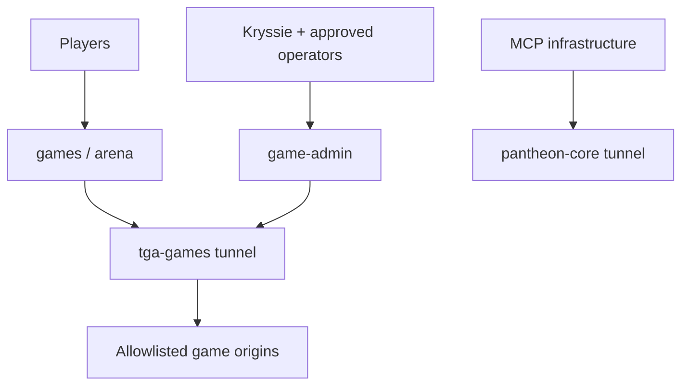

# Tiny Goblin Academy Tunnel Route Taxonomy

Status: planning only; no tunnel, DNS, Access, or service change is authorized.
Domain notation: `<domain>` remains unresolved until Kryssie confirms the controlled Cloudflare zone.

## Product boundary

The first multiplayer target is a browser client plus one authoritative HTTPS/WSS server for a bounded two-player Clash Royale-style prototype. Clients send commands; the server owns match truth, timing, legality, room state, and reconnect decisions.

Not authorized by this plan: raw UDP, peer-authoritative simulation, accounts, matchmaking infrastructure, leaderboards, clans, or a persistent player economy.

## Route catalog

| Route | Purpose / protocol | Exposure and auth | Origin / lifecycle | Tunnel or deploy | Failure and logging boundary | Status / non-goals |
|---|---|---|---|---|---|---|
| `games.<domain>` | Catalog and browser clients; HTTPS | Private Access for Kryssie/Nick, later public | Static/Vite preview; on-demand during development | Tunnel while local; deploy stable clients | Friendly unavailable page; request/build version only | Reserve now; no game authority |
| `arena.<domain>` | Authoritative API and rooms; HTTPS + WSS at `/api/v1`, `/ws`, `/healthz` | Private Access first; game-issued sessions for alpha | Local match server; on-demand then durable host | Tunnel prototype; migrate when uptime matters | Fail closed; match/session IDs, sanitized events, no secrets | Future Stage 2; no raw UDP or client truth |
| `game-admin.<domain>` | Match operations and diagnostics; HTTPS | Private Access, named identities only | Admin surface on allowlisted origin; on-demand | Tunnel/private service | Fail closed; auditable actions | Future; no shell, DB console, filesystem, or Desktop Commander |
| `game-status.<domain>` | Minimal public health/version; HTTPS | Public-safe response; detailed status private | Sanitized status adapter | Deploy or tunnel with arena | Return offline/maintenance; no internal details | Future alpha; no PID, ports, paths, traces, secrets |
| `academy.<domain>` | Durable Academy hub/catalog; HTTPS | Public | Static deployed product | Deploy, not permanent laptop tunnel | CDN/app logs only | Future release; no admin controls |
| `assets.<domain>` | Published assets, manifests, patches; HTTPS | Public read-only | Object storage/CDN | Deploy/storage; tunnel only for bounded preview | 404 missing asset; immutable asset IDs | Future; no source tree or directory listing |
| `updates.<domain>` | Launcher update manifests/build references; HTTPS | Public signed metadata | Artifact/update service | Deploy/storage | Fail closed on invalid signature/version | Only when updater contract exists |
| `replays.<domain>` | Replay/event-log retrieval; HTTPS | Game session or share token | Replay storage/service | Deploy/storage | Not-found/expired; sanitized access logs | Only after deterministic replay persistence exists |
| `accounts.<domain>` | Player identity/profile | Application authentication | Dedicated identity service | Deploy | Fail closed; privacy/audit boundary | Explicitly unjustified for two-player prototype |

## Initial arena contract

- One authoritative process owns each match room.
- Invite codes pair Kryssie and Nick without an account system.
- Secure WebSockets carry commands and server events.
- Reconnect tokens are short-lived and scoped to one room.
- Clients never declare damage, legal placements, resources, winners, or authoritative time.
- `arena.<domain>` initially keeps API and WSS together; split matchmaking/realtime services only after evidence demands it.

## Proposed local-port registry

| Port/range | Owner | Rule |
|---:|---|---|
| `4173-4199` | Static/Vite previews | Allocated by preview tooling; verify free before use |
| `4310` | Pantheon demo gateway | Fixed allowlisted preview gateway, not arbitrary forwarding |
| `4320` | Local games web client | Player client development origin |
| `4330` | Game API/WSS | Authoritative match server |
| `4340` | Game admin/status adapter | Private operations only |
| `8765` | MCP Orchestrator facade | Reserved; never use for preview/game services |

Ports are proposals, not live bindings. A future registry must record owner, command, PID, start time, and expiry for every active preview.

## Trust and tunnel topology

- `pantheon-core`: always-on critical infrastructure; existing MCP route only unless separately approved.
- `tga-games`: player-facing lifecycle; on-demand for private testing, persistent only when justified.
- `pantheon-preview`: workshop traffic belongs elsewhere and must not carry game or MCP authority.
- Multiple hostnames may share one tunnel only when trust boundary and lifecycle match.
- On Windows, one `cloudflared` installation may operate as the service; extra on-demand connectors require explicit supervision or later migration to another host.

## Environments and naming

Prefer flat names: `games-dev.<domain>`, `games-stage.<domain>`, `games.<domain>` and equivalent arena names. Do not assume multi-level wildcard certificate coverage. Use paths for builds/sessions rather than producing DNS entries per preview.

## Growth sequence

1. Stage 0: preserve isolated MCP; reserve `demo`, `games`, and `arena` names only.
2. Stage 1: implement authenticated, on-demand Pantheon demo gateway.
3. Stage 2: private `games` + `arena` + `game-admin` routes for Kryssie/Nick.
4. Stage 3: limited public alpha with application-level sessions and minimal public status.
5. Stage 4: deploy stable static clients and move persistent services off the development laptop when uptime justifies it.

## Approval decisions still open

- Controlled zone: `plw.net`, `pantheonladderworks.net`, or another domain.
- Whether Stage 2 uses one `tga-games` connector on the Windows host or a separate host.
- Access identity policy for Kryssie and Nick during private testing.
- Expiry and reconnect limits for invite codes and room sessions.
- Trigger for moving the authoritative server from the development laptop.
