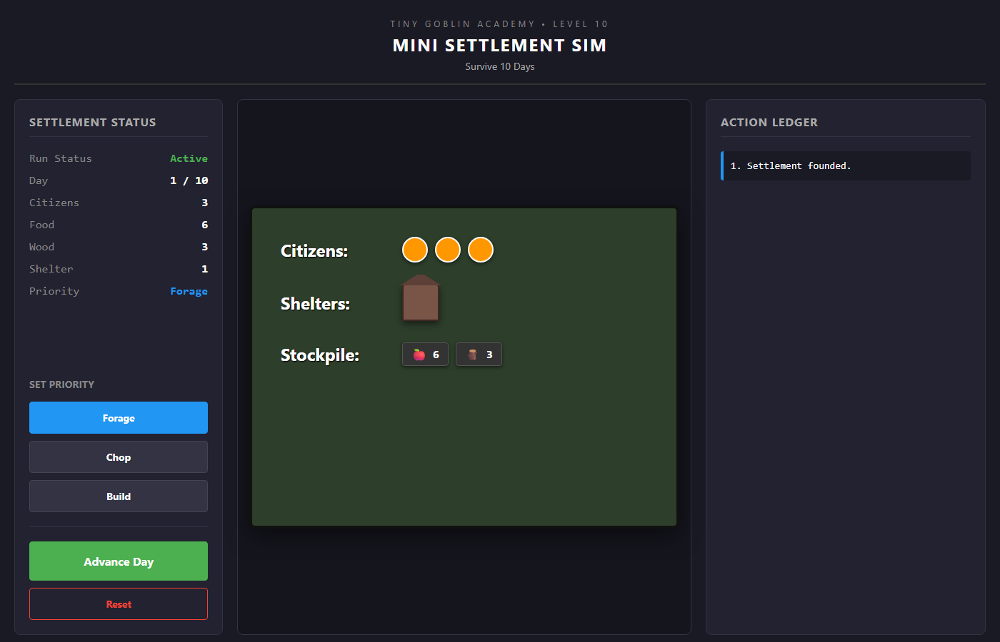
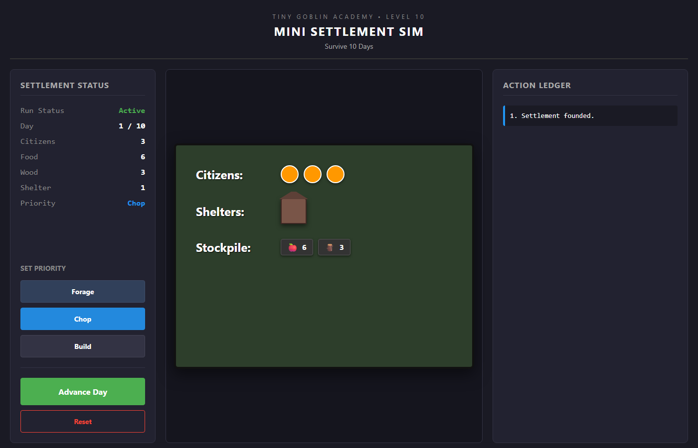
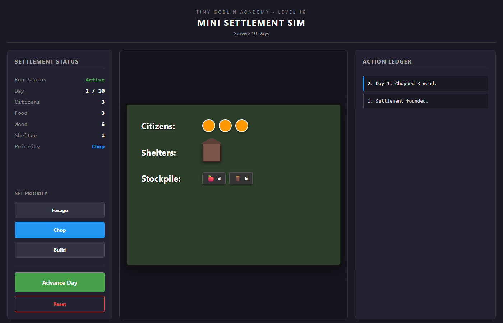
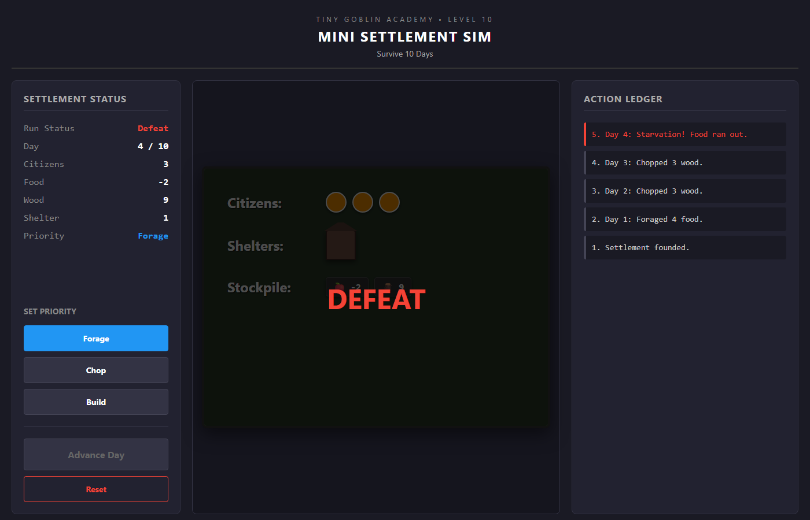
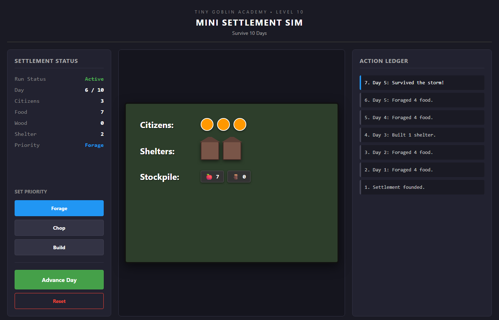
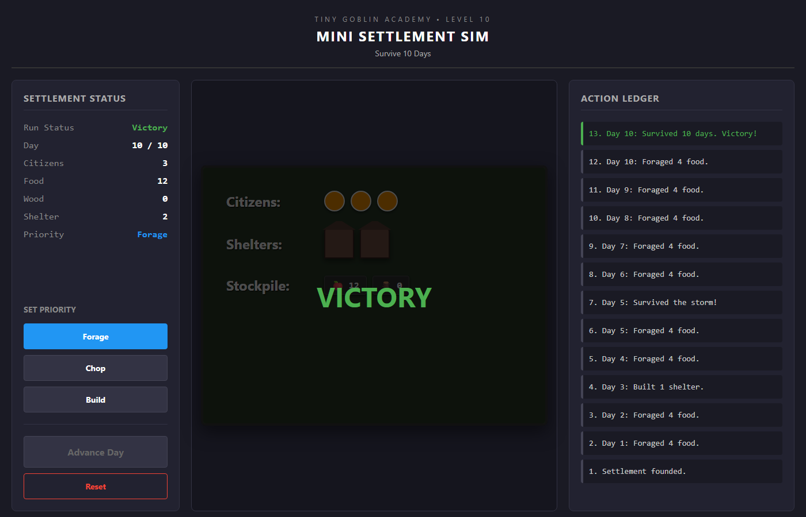

# Level 10 Playtest Report

## Evidence
- `01-boot.png`: 
- `02-priority-selection.png`: 
- `03-advance-day.png`: 
- `04-storm-failure.png`: 
- `05-storm-survival.png`: 
- `06-victory.png`: 

## Observations
- Hunger failure observed in playtest.
- Storm failure observed in playtest.
- Successful Day 10 victory observed in playtest.
- **Note:** Food < 3 is critical because consumption resolves before production.
- **Note:** The short-circuit rule successfully prevents "zombie economics" (Foraging cannot rescue a starved settlement).
- Simulation tests passed via `pnpm vitest run`.
- Capture script successfully navigated and recorded all states without simulation-breaking bugs.
- `advanceDay` correctly applies starvation priority before user-selected priorities, ensuring strict survival consequences.
- The Day 5 Storm checks for >= 2 shelters and gracefully handles defeat/survival.
- Day 10 correctly shorts-circuits to Victory.
- DOM renderer strictly follows `state.runStatus` to display overlays and lock controls.
